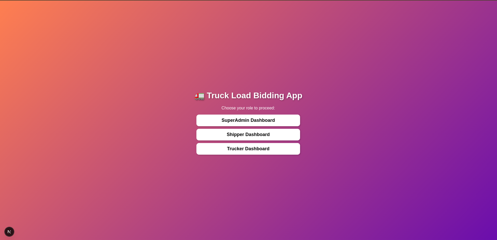

# **Load Posting and Bidding System**  

## **Project Overview**  
This project is a **Load Posting and Bidding System** that connects **shippers** and **truckers** efficiently.  
Shippers can post loads with details, and truckers can view, filter, and bid on loads based on their preferences.  
The system includes a **bidding mechanism** where the lowest bid wins, ensuring fair competition.  
Additionally, strict **eligibility criteria** for truckers help maintain security and reliability.  

---

## 📽️ Demo Video

Watch the demo of the Truck Load Bidding App in action:

[](https://www.loom.com/share/939d4b529a8c492bb81fd12d9c7f3a95?sid=82526de3-e651-43a2-aa72-013db09a92ea)

🔗 [Click here to watch the video](https://www.loom.com/share/939d4b529a8c492bb81fd12d9c7f3a95?sid=82526de3-e651-43a2-aa72-013db09a92ea)


## **Features**  

### **1. Load Posting System**  
- Shippers can post loads with details such as **pickup & drop-off locations, weight, type, and deadline**.  
- Truckers can browse, filter, and search loads based on **route and time preferences**.  

### **2. Bidding Mechanism**  
- Truckers **place bids** on loads.  
- The **lowest bid wins**, ensuring competitive pricing.  
- Automatic bid validation based on trucker’s **eligibility criteria**.  

### **3. Trucker Eligibility Criteria**  
To ensure security and reliability, truckers must meet the following conditions:  
- No history of **accidents**.  
- No **theft complaints**.  
- Truck should be **less than 5 years old**.  
- Driver's license held for **more than 5 years**.  
- Other **relevant safety and compliance checks**.  

---

## **Setup and Installation**  

### **1. Clone the Repository**  
```bash
git clone https://github.com/YOUR_USERNAME/your-private-repo.git
cd your-private-repo
```
### **2. Install dependencies**  
```bash
npm install
```
### ***3. Setup env

### ***4. Start frontend
```bash
npm run dev
```

### ***5. Start backend,
```bash
nodemon server.js
```


## **Technical Overview**  

### **Tech Stack Used**  
- **Backend:** Express  
- **Database:** MongoDB
- **Frontend (if applicable):** Next.js 
- **Authentication:** JWT-based authentication  

### **System Architecture**  
- **Load Posting:** Shippers post loads via a web interface or API.  
- **Matching Algorithm:** Filters loads based on truckers’ preferences.  
- **Bidding System:** Real-time bidding where truckers place competitive offers.  
- **Security & Validation:** Ensures only **eligible truckers** participate.  

## **Project Completion Status**  

| Feature                     | Status                      |
|-----------------------------|----------------------------|
| Load Posting System         | ✅ Completed               |
| Load Filtering & Searching  | ✅ Completed               |
| Bidding Mechanism           | ✅ Completed               |
| Trucker Eligibility Check   | ✅ Completed               |
| API Documentation           | ✅ Completed               |
| Deployment                  | ⚠️ Partially Implemented   |
| Advanced Features           | ❌ Not Implemented (Time Constraint) |


## **Future Improvements**  
- **Real-time notifications** for new loads and winning bids.  
- **AI-powered route optimization** for better matches.  
- **Multi-language support** for international users.  
- **Smart contract integration** for payment security.  
- **Enhanced user interface** for better user experience.
- **Scalability and performance** improvements for large user bases.
